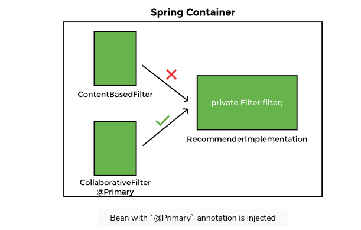
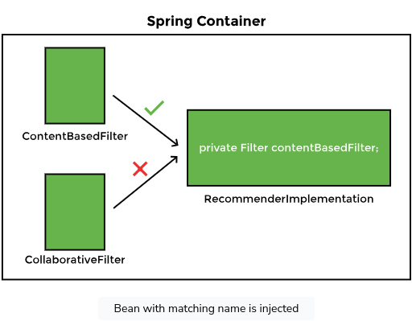
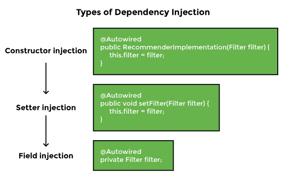
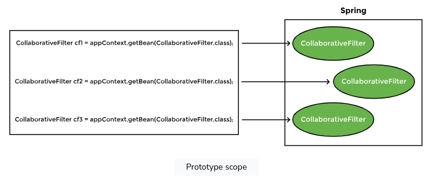

# spring Basics

## Lesson 4 & 5:

autowiring by name and the @Primary annotation
are features that provide control over dependency
injection resolution when multiple beans of the same type are available:
`
@Component
@Primary`

``@Autowired
private Filter contentBasedFilter;``

## Lesson 6: @Qualifier @Qualifier

The @Qualifier annotation can be used in a scenario when we have multiple objects of the same type and autowiring by
name cannot be used because the variable name doesn’t match any bean name

The @Qualifier annotation takes precedence over the @Primary annotation. To show this, let’s add the @Primary annotation
to the ContentBasedFilter class and run the application

## Lesson 7: Constructor, setter, field injection

### notes:

* Using field injection keeps the code simple and readable, but it is unsafe
* there are some differences between Constructor and setter injection. Setter injection is more readable as it specifies
  the name of the dependency as the method name but the number of setter methods increases with each increasing
  dependency increasing the boiler plate code. Setter injection is used to avoid the BeanCurrentlyInCreationException
  raised in case of a circular dependency

## Spring In-depth

### lesson 8: Bean Scope

The Spring container manages beans. The term bean scope refers to the lifecycle and the visibility of beans. It tells
how long the bean lives, how many instances of the bean are created, and how the bean is shared.

## **Singleton**, **Prototype**

The default scope of a bean is singleton, in which only one instance of the bean is created and cached in memory.
Multiple requests for the bean return a shared reference to the same bean. In contrast, prototype scope results in the
creation of new beans whenever a request for the bean is made to the application context.

### Lesson 9: Mixing Bean Scope

The prototype bean is injected into the singleton bean at the time of creation of the singleton bean when the container
initializes it. This explains the following messages in the output:

ContentBasedFilter constructor called

Movie constructor called

The same instance of the bean is returned by the application context every time it is requested using the getMovie
method.
we can solve this problem with the PROXY for add indirection to get autowire and this happened when we add this "
proxyMode=ScopedProxyMode.TARGET_CLASS" to scope annotation in the movie class.

Movie bean with prototype scope
Movie constructor called
io.datajek.spring.basics.movierecommendersystem.lesson9.Movie@4390f46e

this the output when we add proxy to scope annotation (we can solve this problem with @Lookup on getMovie function)
Movie constructor called

io.datajek.spring.basics.movierecommendersystem.lesson9.Movie@7c6442c2

Movie constructor called

io.datajek.spring.basics.movierecommendersystem.lesson9.Movie@2d746ce4

## Lesson 10: @ComponentScan

* Spring does a component scan to search for the beans that it manages. In a Spring application, the **_@ComponentScan_
  ** annotation without any argument tells Spring to scan the current package as well as any sub-packages that might
  exist. Spring detects all classes marked with the @Component, @Repository, @Service, and @Controller annotations
  during component scan.

### The @SpringBootApplication:

The @SpringBootApplication annotation is a combination of three annotations:

* @Configuration + @EnableAutoConfiguration + @ComponentScan

when we use this annotation spring searches the package where it is present, as well as all the sub-packages. If a bean
is present in a package other than the base package or its sub-packages, it will not be found.
* @**_ComponentScan_** for specific package:
@ComponentScan is used to specify the packages that should be scanned for Spring components, such as @Controller,
@Service, and @Repository. By default, it scans the current package and its sub-packages. However, you can specify
specific packages to be scanned using the basePackages attribute.